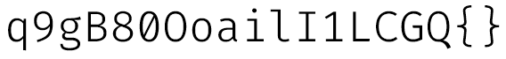

This is mostly for my reference if I need it. Some of it may be useful to others.

# Fonts

Fonts should be readable with characters that are easy to distinguish from each other even with poor vision. Most fonts fail at this, even if they're mostly readable. Atkinson Hyperlegible does a great job and is my gold standard for comparison, hence my [userscript to change web pages](https://github.com/Tanath/dotfiles/blob/master/browsers/Set%20font%20to%20Atkinson%20Hyperlegible.user.js) to it. On desktop you can turn off the ability for pages to set their fonts, but for some sites like font sites, you don't want that, and mobile lacks that feature.  
For mono, the best fonts I've found which don't fail at this are Fira Code, Source Code Pro (mostly), or Hasklug. Fira Code is a bit better designed than Source Code Pro, but has ligatures which is unacceptable sometimes, and SCP is more widely and easily available. Check these characters in your font:

* q9gB80OoailI1LCGQ{}
* `q9gB80OoailI1LCGQ{}`

Noto did a good thing trying to eliminate tofu, but AH did a better thing making a readable font. To combine those things you can use [Atkinson Hyperlegible Pro](https://github.com/jacobxperez/atkinson-hyperlegible-pro). To install on Linux, you can put fonts like AHP in `~/.local/share/fonts`. For the others, check for `fonts-firacode`, and `texlive-fonts-extra` for AH and SCP. 
On Windows you can use `scoop install firacode` or `choco install firacode atkinson-hyperlegible`. There's no scoop package for AH yet so you'll have to [download it](https://brailleinstitute.org/freefont) yourself (though I recommend the pro version above).

Here are examples of common fonts which suck at this, plus AH & FC for comparison:
* Arial:

	
* Consolas:

	
* DejaVu Sans:

	
* Noto Sans:

	
* Segoe UI:

	
* Source Code Pro is decent:

	
* Tahoma:

	
* Verdana:

	
* Monoid's design is great, but it's too tall (like double the height of AH):

	
* Fira Code is great:

	
* Atkinson Hyperlegible is great:

	

# Clock applet format
Date format: 

```
%H:%M %p%n%a. %b. %e
```

Tooltip:

```
%I:%M %p%n%Y-%m-%d
```

[Syntax reference](https://foragoodstrftime.com/).

# Default web browser for xdg-open

```sh
xdg-settings set default-web-browser firefox.desktop
```

# Keyboard

Enable Magic sysrq keys:

* To use these, they must first be activated with either ```sysctl kernel.sysrq=1``` or ```echo "1" > /proc/sys/kernel/sysrq```. If you wish to have it enabled during boot, edit `/etc/sysctl.d/99-sysctl.conf` and insert the text `kernel.sysrq = 1`. If you want to make sure it will be enabled even before the partitions are mounted and in the initrd, then add `sysrq_always_enabled=1` to your kernel parameters.

## Swap caps & esc

I recommend swapping <kbd>caps</kbd> & <kbd>esc</kbd>. <kbd>esc</kbd> is much more useful for most people than <kbd>caps</kbd>, which is rarely used, so it makes sense to swap them. If this isn't true for you, then this doesn't apply for you. Some do similar things like turning <kbd>caps</kbd> into another <kbd>ctrl</kbd>, but that makes little sense when there's already a <kbd>ctrl</kbd> right there, two keys away, which you can hit with the side of your hand, or pinky if you're reaching.

I used to use this, which only applies to X and not in virtual terminals (eg. <kbd>ctrl</kbd>+<kbd>alt</kbd>+<kbd>f2</kbd>). Resume from suspend also reverts it for me.

```sh
setxkbmap -option "caps:swapescape"
```

If you don't mind it only working in the GUI and use Cinnamon, you can just change it in the keyboard layout options, at the bottom of the options for <kbd>caps</kbd>.  
If you want to keep it permanent and consistent everywhere so you don't get thrown if you end up in a VT after getting used to it, use udev to swap keys in the kernel. For my keyboard I put the following in `/usr/lib/udev/hwdb.d/70-keyboard.hwdb`:

```
# Microsoft Natural Ergonomic Keyboard 4000

evdev:input:b0003v045Ep00DB*
 KEYBOARD_KEY_70039=esc                                 # caps > esc
 KEYBOARD_KEY_70029=capslock                            # esc > caps
 KEYBOARD_KEY_c022d=up                                  # zoomin
 KEYBOARD_KEY_c022e=down                                # zoomout
```

Then run:

    ```sh
    sudo systemd-hwdb update
    ```

    ```sh
    sudo udevadm trigger
    ```

For more info on remapping keys on Linux, and how to determine the config for your keyboard, see:

* https://wiki.archlinux.org/index.php/Keyboard_input
* https://wiki.archlinux.org/index.php/Map_scancodes_to_keycodes

# Mount virtualbox shared folder in Linux

```sh
sudo mount -t vboxsf vbox-shared /mnt/vbox-shared
```

# Enable VTs

Edit `/etc/systemd/logind.conf` to have `NAutoVTs=4`.
Should take effect immediately.

# Package management/building

## Automatically clean the package cache.

```sh
sudoedit /usr/share/libalpm/hooks/pacman_cache.hook
```
Contents:

```
[Trigger]
Operation = Upgrade
Operation = Install
Operation = Remove
Type = Package
Target = *

[Action]
Description = Cleaning pacman cache...
When = PostTransaction
Exec = /usr/bin/paccache -rk2
```

## Check for firmware updates.

```sh
sudoedit /etc/pacman.d/hooks/fwupd.hook
```
Contents:

```
[Trigger]
Operation = Install
Operation = Upgrade
Type = Package
Target = *

[Action]
Depends = fwupd
When = PostTransaction
Exec = /usr/bin/fwupdmgr get-updates
Description = Checking for firmware updates...
```

## Manjaro driver installation
Find classid, then use it to install:

```sh
mhwd --pci -l -d | grep 'INFO\|CLASS'
```
```sh
sudo mhwd -a pci nonfree <classid>
```

# QT & GTK
* https://wiki.archlinux.org/index.php/Uniform_look_for_Qt_and_GTK_applications
* https://wiki.manjaro.org/index.php?title=Set_all_Qt_app%27s_to_use_GTK%2B_font_%26_theme_settings

Install `qt5-styleplugins` and `qt5ct`. Restart, run `qt5ct` from terminal and select gtk2.
For gtk2 apps install `gtk-theme-switch2` and select theme.

# Bootable USB w/various ISOs

This section is outdated. Use [Ventoy](https://github.com/ventoy/Ventoy#--ventoy) now.

1. Install syslinux:

	```sh
	sudo pacman -S syslinux
	```
	or
	```sh
	sudo apt-get install syslinux
	```
2. Repartition and format USB as FAT.
3. Mark as bootable.
	Use gparted.
	Set label.
4. Copy syslinux master boot record to drive:

	```sh
	sudo dd if=/usr/lib/syslinux/mbr.bin of=/dev/sdg
	```
5. Install syslinux on the drive partition:

	```sh
	sudo syslinux /dev/sdg1
	```
6. Mount the drive.
	Use file manager or,
	
	```sh
	sudo mount /dev/sdg1 /media/temp
	```
7. Copy the memdisk bootloader to drive:

	```sh
	sudo cp /usr/lib/syslinux/memdisk /media/temp
	```
8. Copy the .iso to drive.
9. Create file named `syslinux.cfg` on drive with the following, using correct iso name:

```
DEFAULT labelname
LABEL labelname
  LINUX memdisk
  INITRD filename.iso
  APPEND iso
```
10. Done! Boot with it.
11. [Troubleshoot](https://www.syslinux.org/wiki/index.php/MEMDISK#INT_13h_access:_Not_all_images_will_complete_the_boot_process.21)

# Blocking net in Wine
1. `wine regedit`
2. Go to: `HKEY_CURRENT_USER\Software\Microsoft\Windows\CurrentVersion\Internet Settings`
3. You should see a ProxyEnable key that is set to 0. Set it to 1.
4. Create the following DWORD values (right-click and select new):
	"MigrateProxy" set to
	"ProxyHttp.1.1" set to 0
5. Create the following Strings:
	"ProxyOverride" set to "<local>"
	"ProxyServer" set to "http://prohibited:80"
	"UserAgent" set to "Mozilla/4.0 (compatible; MSIE 8.0; Win32)"

